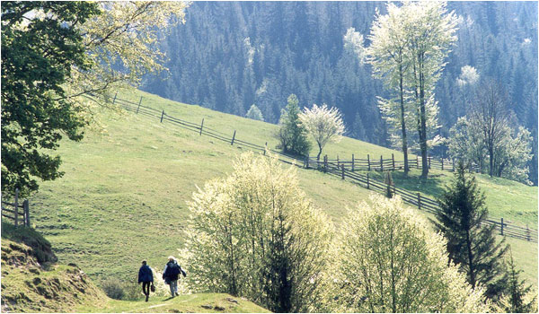

__Ukraine is a country, situated in the centre of Europe
It has a long history, beautiful landscapes, interesting traditions and rich culture.
It has approximately 45 millions inhabitants and the area is 603 628 square kilometers.
The capital of this county is beautiful and ancient city – Kyiv, which is proud of its architectural monuments, green parks and well-looking squares.__

> _If you have decided to visit this country, you can be sure, that your trip will not be boring and you will get great impressions. 
Ukraine offers a long list of places to visit. 
Among them, there are the Carpathians, where you can breathe the fresh air and see amazing nature. If you love the extreme, you can go hiking and climbing. 
If you are visiting Ukraine in summer, there are many lakes, where you can spend unforgettable time. 
If you are interested in history of Ukrainians, you can visit **Zaporizhzhia**, where the kozaks lived. 
There also a lot of castles in different parts of the country and a big number of ancient churches. 
Among the most famous cities are **Kyiv**, **Lviv**, **Kamianets Podilskyi**, **Kharkiv**, **Odessa**, and **Chernivtsi**._

## *History of Ukraine*

Ukraine was known as “Kievan Rus” (from which Russia is a derivative) up until the 16th century. In the 9th century, Kiev was the major political and cultural center in eastern Europe. Kievan Rus reached the height of its power in the 10th century and adopted Byzantine Christianity. The Mongol conquest in 1240 ended Kievan power. From the 13th to the 16th century, Kiev was under the influence of Poland and western Europe. The negotiation of the Union of Brest-Litovsk in 1596 divided the Ukrainians into Orthodox and Ukrainian Catholic faithful. In 1654, Ukraine asked the czar of Moscovy for protection against Poland, and the Treaty of Pereyasav signed that year recognized the suzerainty of Moscow. The agreement was interpreted by Moscow as an invitation to take over Kiev, and the Ukrainian state was eventually absorbed into the Russian Empire.
After the Russian Revolution, Ukraine declared its independence from Russia on Jan. 28, 1918, and several years of warfare ensued with several groups. The Red Army finally was victorious over Kiev, and in 1920 Ukraine became a Soviet republic. In 1922, Ukraine became one of the founders of the Union of Soviet Socialist Republics. In the 1930s, the Soviet government's enforcement of collectivization met with peasant resistance, which in turn prompted the confiscation of grain from Ukrainian farmers by Soviet authorities; the resulting famine took an estimated 5 million lives. Ukraine was one of the most devastated Soviet republics after World War II. (For details on World War II, see Headline History, World War II.) On April 26, 1986, the nation's nuclear power plant at Chernobyl was the site of the world's worst nuclear accident. On Oct. 29, 1991, the Ukrainian parliament voted to shut down the reactor within two years' time and asked for international assistance in dismantling it.

## *Opera and Theater*

Ukraine has a vibrant opera and theater scene. For a schedule of performances visit the websites of these and other popular venues:
- [National Opera & Ballet Theater of Ukraine, Kyiv, Ukraine](https://www.opera.com.ua/)
- [Lviv Opera & Ballet Theater, Lviv, Ukraine](http://opera.lviv.ua/)
- [National Ivan Franko Theater of Drama in Ukraine, Kyiv, Ukraine](http://ft.org.ua/)
- [Lviv Drama Theater of Maria Zankovetska, Lviv, Ukraine](http://www.zankovetska.com.ua/)
- [The Odesa State Academical Opera and Ballet Theater, Odesa, Ukraine](http://www.opera.odessa.ua/)

## *Ukrainian Cuisine*

**varenyky**

Varenyky are small boiled dumplings made with rolled dough and filled with a special type of potato and cheese or some other filling. Almost all restaurants serve them, usually with either cheese or meat, and almost always with sour cream or a buttery sauce. Pyrohy usually refers to larger baked, pie-like varenyky filled with the same kinds of ingredients. Smaller, appetizer-sized versions of pyrohy are called pyrizhky, which are either baked or fried.

**borshch**

The national soup, which has also been adopted by other Slavic cultures, borsch is based on a beet and mixed vegetable broth that comes in dozens of varieties. The most popular version is a clear broth, but sour cream is often added.

**holubtsi**

Translated as “little doves,” holubtsi are cabbage rolls stuffed with seasoned rice and meat or buckwheat. The dish is usually topped with a tomato-based sauce.

**kotleta po-kylvsky**

Known to the English-speaking world as Chicken Kiev, kotleta po-Kylvsky is a chunk of boneless chicken stuffed with butter, then seasoned, floured, and deep-fried.

**kasha**

Kasha is basically a grain-based cereal. The most common kind is hrechana kasha, a buckwheat porridge, seasoned and eaten with a sauce as a side dish or as a stuffing.

**khleeb (“bread”)**

Khleeb is the Ukrainian word for bread. Sweet breads and rolls (bulochky) are steeped with honey and are often associated with holidays or ceremonies. Babka is a sweet egg bread popular during Easter, but available all year. Kalach is similar to babka, but denser and braided into a circular shape. Paska is the official Easter bread, usually decorated and shaped into a cross. Korovay is a tall, cylindrical traditional wedding bread. Pampushki can be fresh rolls soaked in crushed garlic and oil, or a sort of sweet jam or fruit-filled baked roll. Makivnik is a sweet poppy-seed bread flavored with honey and molasses, popular around Christmas. Khrusty are deep-fried strips of sweet dough coated with sugar, and medivnyk is a honey cake that can keep for days without going stale.

## **Must See Places**

**St. Michael’s Golden – Domed Cathedral**

 
**St. Sophia’s Cathedral**

 
**Golden Gates of Kyiv**

 
**Kyiv – Pechersk Cave Monastery**

 
**Historic Lviv City Center – UNESCO World Heritage Site**

 
**Kamianets – Podilskyi Castle**

 
**Carpathian Mountains**

 
**Chernivtsi National University Campus**

 

Tables
First Header | Second Header
------------ | -------------
Content from cell 1 | Content from cell 2
Content in the first column | Content in the second column

Issue references within a reposit
#1
mojombo#1
mojombo/github-flavored-markdown#1
